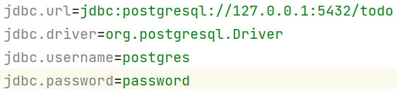
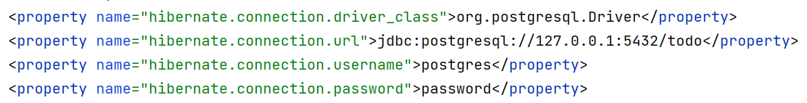
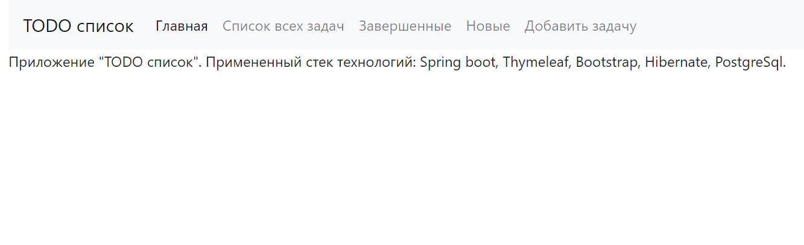

### Приложение "TODO list"
> **Используемы технологии**: Spring boot, Thymeleaf, Bootstrap, Hibernate, PostgreSql

***
**Требуемые элементы:** 
* PostgreSql 14 
* JDK 17
* Maven 3.8.1
***
**Перед запуском проекта:** 
* создать базу данных с именем ***todo***
* поменять login/password в файлах src/main/resources/db.properties
и src/main/resources/hibernate.cfg.xml на требуемый 
  

***
**Запуск приложения:** 
* запустить метод *main* в классе *src/main/java/ru/job4j/todo/Main.java*
* после запуска сервера перейти на адрес: *http://localhost:8080/index*
***
Приложение позволяет:
* добавлять задачи в список
* удалять задачи
* помечать задачи как выполненные
* редактировать задачи
* отображать завершенные/незавершенные задачи отдельными списками
 
Главная страница

Список всех задач (завершенных/незавершенных)

Список завершенных задач

Список новых задач

Добавление новой задачи

При нажатии на имя задачи пользователь попадает в меню управления задачей

При нажатии на кнопку "Изменить задачу" происходит переход в меню редактирования задачи

