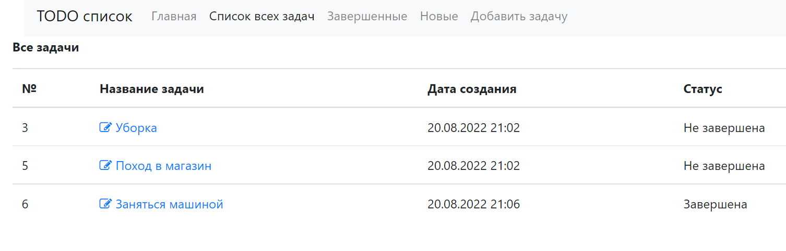
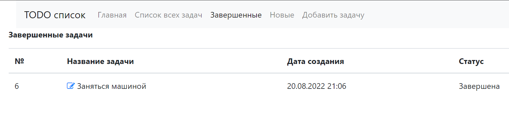
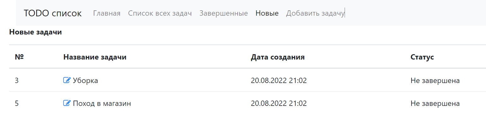
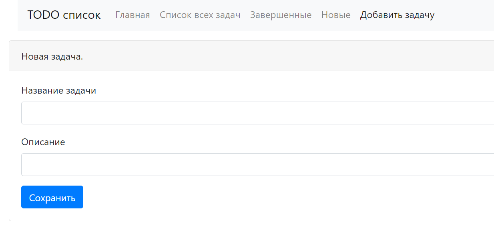
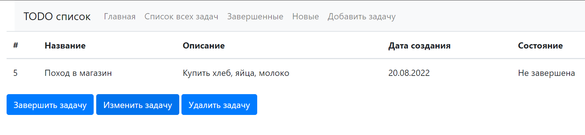
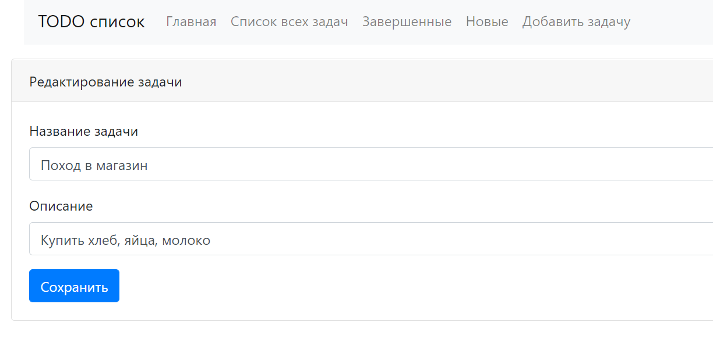

### Приложение "TODO list"

Приложение позволяет:
* добавлять задачи в список
* удалять задачи
* помечать задачи как выполненные
* редактировать задачи
* отображать завершенные/незавершенные задачи отдельными списками
 
Главная страница

Список всех задач (завершенных/незавершенных)

Список завершенных задач

Список новых задач

Добавление новой задачи

При нажатии на имя задачи пользователь попадает в меню управления задачей

При нажатии на кнопку "Изменить задачу" происходит переход в меню редактирования задачи

